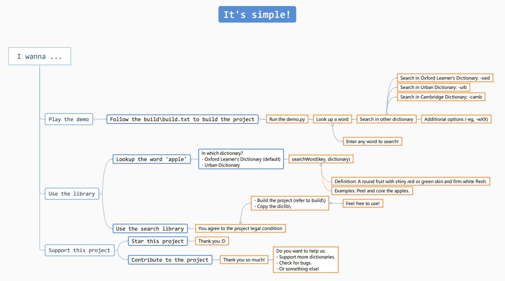
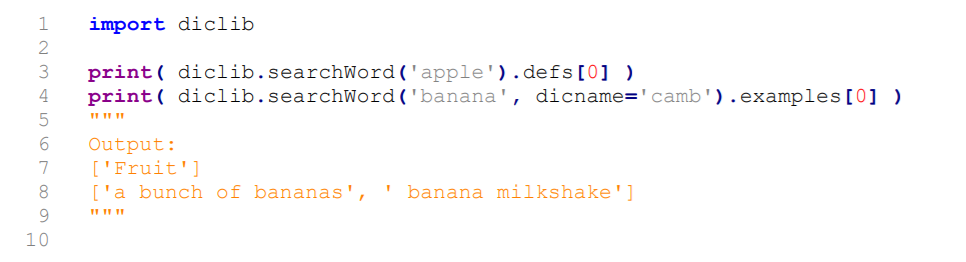

# Word-Search (diclib)
A simple word searcher(from Oxford Dictionary & Urban Dictionary & Cambridge Dictionary).

## Features
- A simple program that do interactive dictionary searches.
- Include an extensible library that search & parse online dictionary.
- Now it supports 3 online dictionaries!

## Version: alpha 3.0 -- build004

- ~*Oxford Learner's Dictionary*~ & *Urban Dictionary* & *Cambridge Dictionary* are all available now!
- *Oxford Learner's Dictionary* has updated their web, web parser now requires update (currently *Cambridge Dictionary*
is set to default).

## License & Disclaimer
This project is licensed under the terms of the MIT license.

This project contains copyrighted content. Usage of it is stated in legal\FAIR_USE_DISCLAIMER.
